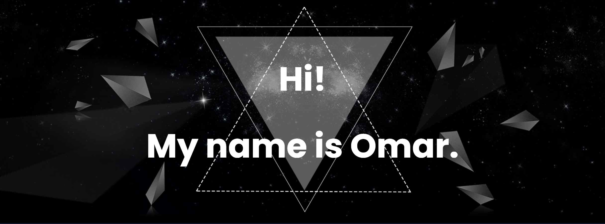

***

***
<picture>
  <source align="left" width="300" srcset="profile_images/triangles.gif" media="(prefers-color-scheme: dark)"/>
  
</picture>

 

<h3>My knowledge:</h3>

***

  
  
  
  
  
  

<!--

-->

